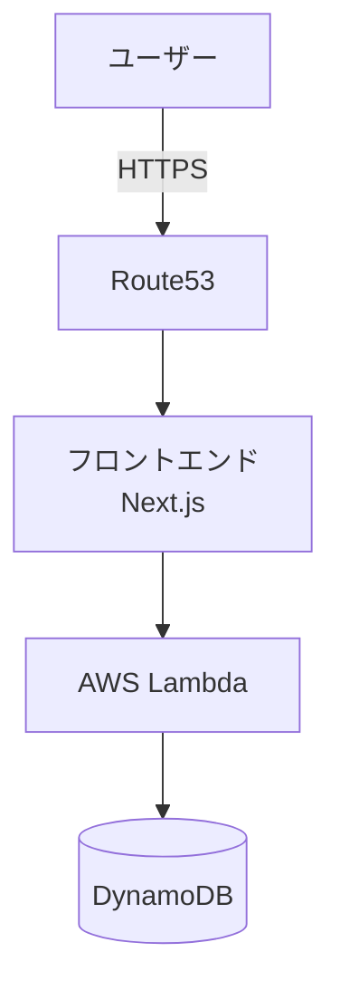
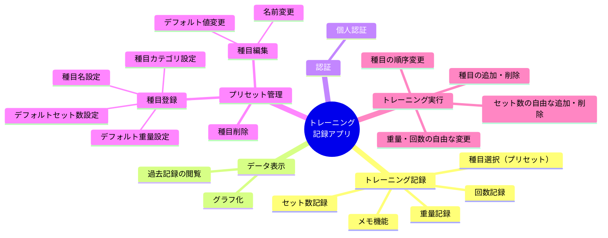
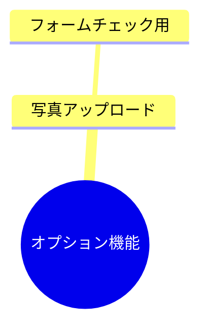
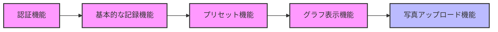
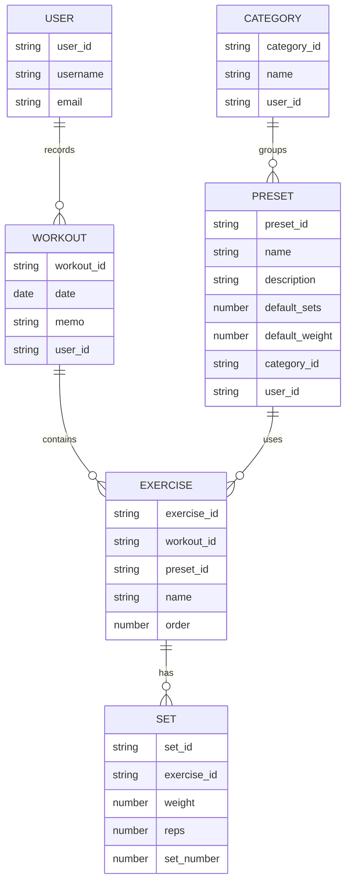
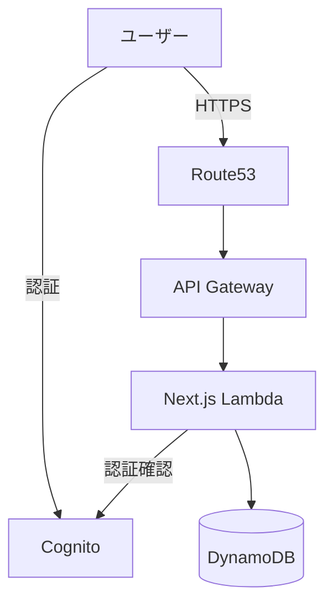
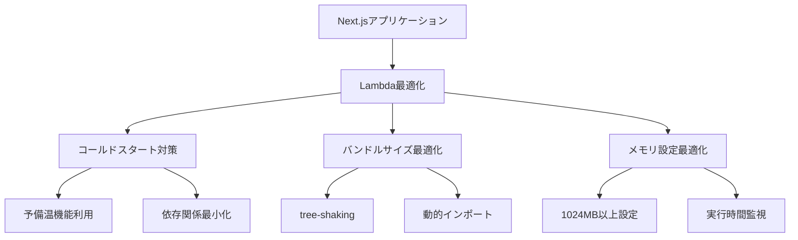

# トレーニング記録アプリケーション要件定義書

## 1. システム概要

### 1.1 目的
個人の筋力トレーニングを記録・管理するためのWebアプリケーション

### 1.2 システム構成図



## 2. 機能要件

### 2.1 必須機能


### 2.2 オプション機能


## 3. 非機能要件

### 3.1 性能要件
- レスポンス時間: 3秒以内
- 同時接続数: 1ユーザーのみ
- データ保存期間: バックアップ不要

### 3.2 セキュリティ要件
- HTTPS通信必須
- 個人認証必須
- 他者からのアクセス制限

### 3.3 ユーザビリティ要件
- レスポンシブデザイン対応（モバイルファースト）
- PCでのグラフ表示最適化
- 直感的な操作性

## 4. 開発要件

### 4.1 技術スタック
- フロントエンド: Next.js
- バックエンド: AWS Lambda
- データベース: DynamoDB
- DNS: Route53
- 認証: AWS Cognito

### 4.2 開発期間
- 目標: 1週間

### 4.3 開発優先順位


## 5. データモデル

### 5.1 基本構造


## 6. 技術アーキテクチャ

### 6.1 詳細構成図


### 6.2 技術スタック詳細

#### アプリケーション（Lambda上のNext.js）
- **Next.js 14**
  - App Router
  - Server Components
  - @vendia/serverless-express でLambda対応
- **UI/コンポーネント**
  - TailwindCSS
  - Headless UI
  - React Hook Form（フォーム管理）
  - Chart.js（グラフ表示）
- **状態管理**
  - Server Components + Server Actionsの活用
  - Zustand（必要な場合のみクライアントステート用）

#### バックエンド構成
- **実行環境**
  - Node.js 20.x runtime
  - TypeScript
  - AWS SDK v3
- **API実装**
  - Next.js API Routes
  - Server Actions
  - API Gateway HTTP API

#### データベース（DynamoDB）
- **テーブル設計**
  ```
  WorkoutTable:
    PK: USER#${userId}
    SK: WORKOUT#${date}#${workoutId}
    GSI1PK: DATE#${date}
    GSI1SK: USER#${userId}
    
  ExerciseTable:
    PK: WORKOUT#${workoutId}
    SK: EXERCISE#${exerciseId}
    GSI1PK: USER#${userId}
    GSI1SK: DATE#${date}

  PresetTable:
    PK: USER#${userId}
    SK: PRESET#${presetId}
  ```

### 6.3 Lambda最適化設計


### 6.4 開発環境
- **必要なツール**
  - Node.js 20.x
  - TypeScript
  - AWS CLI

- **ローカル開発環境**
  ```mermaid
  graph TD
    A[開発環境] --> B[ローカル開発モード]
    A --> C[本番モード]
    
    B --> D[Next.js Dev Server]
    B --> E[DynamoDB Local]
    B --> F[Local認証]
    
    C --> G[Lambda]
    C --> H[DynamoDB]
    C --> I[Cognito]
  ```

- **開発モードの構成**
  - Next.js開発サーバー（`next dev`）
  - DynamoDB Localでデータベースをエミュレート
  - 認証は開発用の簡易認証に置き換え
  - 環境変数で切り替え（.env.development / .env.production）

- **開発からデプロイまでのフロー**
  ```mermaid
  graph LR
    A[ローカル開発] --> B[テスト]
    B --> C[ビルド]
    C --> D[Lambda用パッケージング]
    D --> E[デプロイ]
    
    subgraph ローカル環境
    A
    B
    end
    
    subgraph デプロイ準備
    C
    D
    end
    
    subgraph AWS環境
    E
    end
  ```

### 6.5 パフォーマンス最適化
- Lambda関数のメモリ: 1024MB以上を推奨
- 依存関係の最小化
- 画像最適化はNext.jsの機能を利用
- Server Componentsの積極的な活用でクライアントバンドルを最小化 

### 6.6 開発プロセス
- **ローカル開発手順**
  1. `npm run dev` でNext.js開発サーバー起動
  2. DynamoDB Localの起動
     ```bash
     docker run -p 8000:8000 amazon/dynamodb-local
     ```
  3. 開発用の環境変数設定
     ```
     # .env.development
     NEXT_PUBLIC_API_URL=http://localhost:3000/api
     DYNAMODB_ENDPOINT=http://localhost:8000
     AUTH_MODE=development
     ```

- **本番環境への移行手順**
  1. 本番用ビルド
     ```bash
     npm run build
     ```
  2. Lambda用パッケージング
     ```bash
     npm run package:lambda
     ```
  3. デプロイ
     ```bash
     npm run deploy
     ``` 